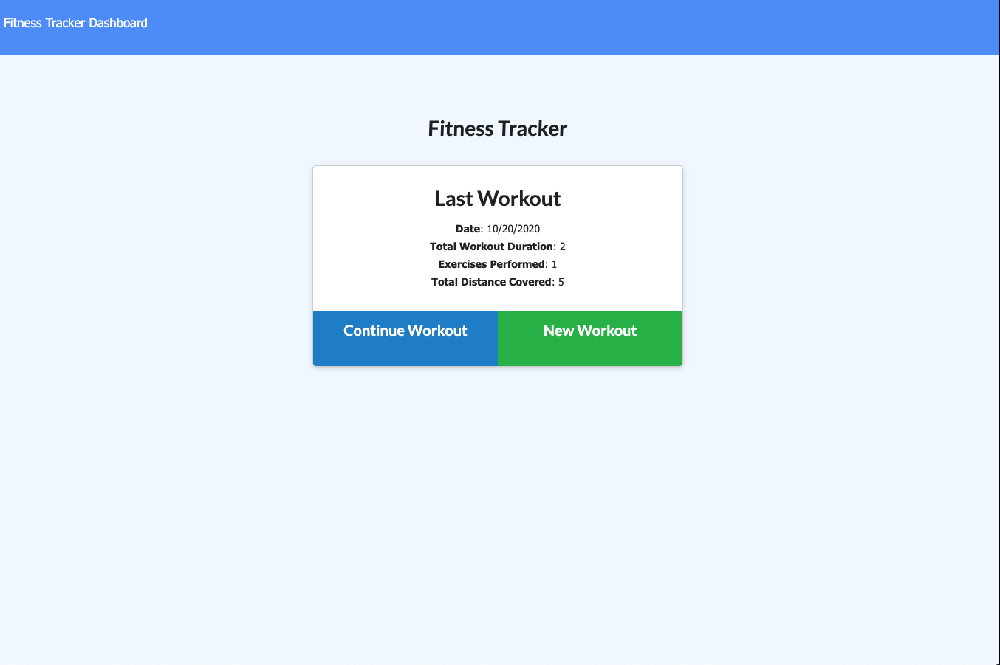
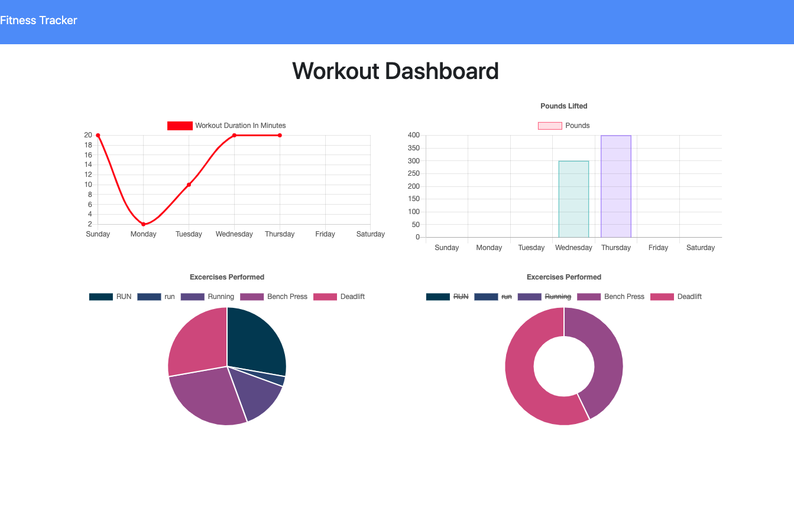

### Workout-Tracker

## Deployment: 
Link to working application: https://aqueous-sea-63071.herokuapp.com/

## Description
An application that utilizes MongoDB to store and track user's fitness data. This application highlights the benefits of using Mongo.

## User Story
As a user, I want to be able to view create and track daily workouts. I want to be able to log multiple exercises in a workout on a given day. I should also be able to track the name, type, weight, sets, reps, and duration of exercise. If the exercise is a cardio exercise, I should be able to track my distance traveled.

## Business Context
A consumer will reach their fitness goals more quickly when they track their workout progress.

## License
This project is licensed under MIT license.

## Contribution
Rayan Ahmedy

## Tests
Run the following command: npm start

## Contact 
rayanahmedy1999@gmail.com

## GitHub account:
https://github.com/rahmedy

